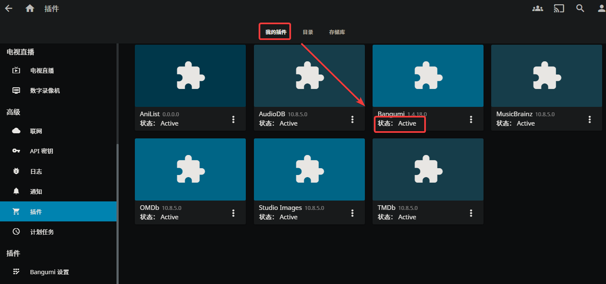
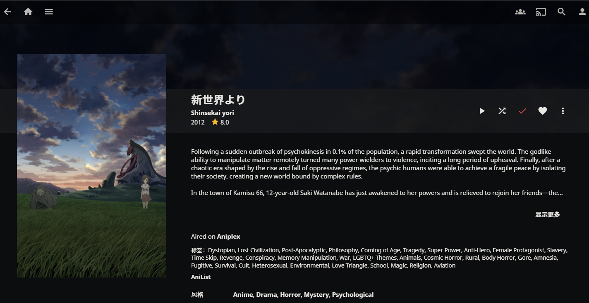
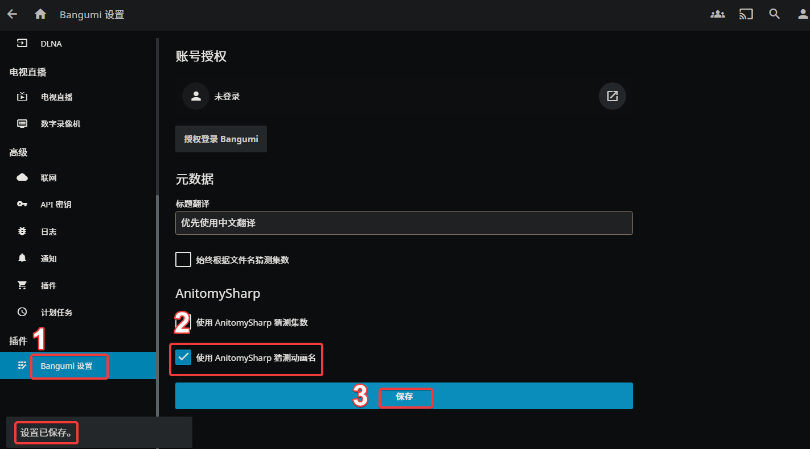
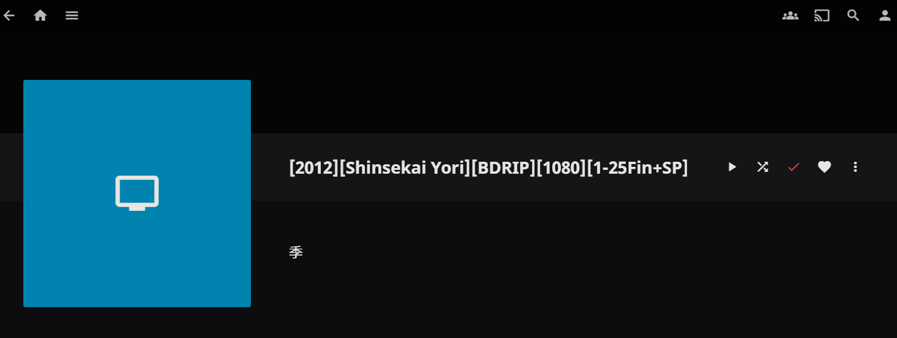
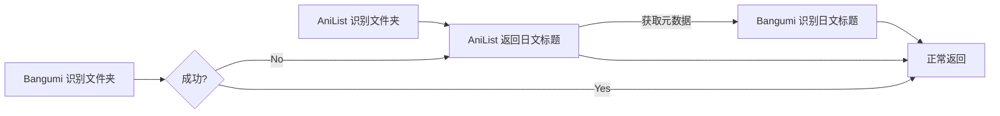
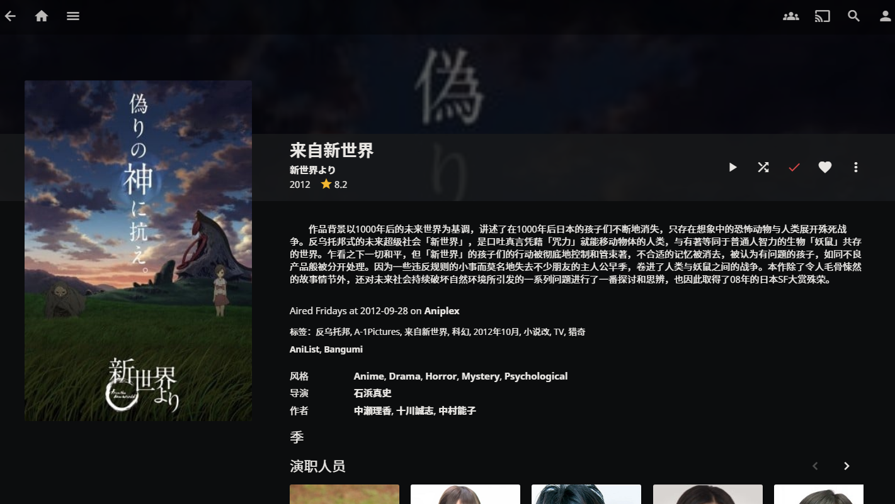

# 在Jellyfin中使用本项目

!!! info "必读"
	目前插件正在绝赞开发中，文档内容可能已过时

> 本文档最后更新于：**2022-10-07 21:30** ，请注意文章时效性！

## 要求

1. <mark style="background: #FF5582A6;">必须</mark>清楚如何手动安装插件
2. <mark style="background: #ABF7F7A6;">应该</mark>清楚如何查看日志

### 手动安装插件

`Windows`平台：插件一般在安装时选择的数据目录下，比如：`C:\ProgramData\Jellyfin\Server\plugins\Bangumi`

更多信息见[官方文档](https://jellyfin.org/docs/general/server/plugins/index.html)

### 查看日志

`Windows`平台：右下角托盘图标右键，选择 `Show Logs`

## 前置步骤

### 添加 AnitomySharp

插件安装完成后，下载和此插件相匹配的 [AnitomySharp](https://github.com/chu-shen/AnitomySharp/releases/latest) ，然后将 `AnitomySharp.dll` 复制到插件目录下的任意子目录，如：`plugins\Bangumi\AnitomySharp.dll`

!!! danger "注意"
	此插件仅保留一个，勿重复添加

### 重启Jellyfin

安装完成后，需要重启 Jellyfin 并确认插件处于 `Active` 状态


## 在AniList插件中使用本项目

插件来源：[AniList](https://github.com/chu-shen/jellyfin-plugin-anilist-with-filter/releases/latest)

### 配置插件

将 `Title Language` 修改为 `Japanese`，然后点击保存

### 添加媒体库

添加节目媒体，文件夹选择 `C:\Jellyfin\Data\Bangumi`，该目录下有一部动画：`[2012][Shinsekai Yori][BDRIP][1080][1-25Fin+SP]`

元数据相关选项仅勾选 `AniList` ，其余配置自行按需选择

刷新媒体库元数据，此时检查日志会发现如下信息：

```log
[INF] [67] Jellyfin.Plugin.AniList.Providers.AniList.AniListSeriesProvider: Start AniList... before Searching ("[2012][Shinsekai Yori][BDRIP][1080][1-25Fin+SP]")
[INF] [67] Jellyfin.Plugin.AniList.Providers.AniList.AniListSeriesProvider: Start AniList... Searching("Shinsekai Yori")
[INF] [67] Jellyfin.Plugin.AniList.Providers.AniList.AniListSeriesProvider: AnitomySharp ca8cafd0, ElementFileName: Shinsekai Yori
[INF] [67] Jellyfin.Plugin.AniList.Providers.AniList.AniListSeriesProvider: AnitomySharp ca8cafd0, ElementAnimeTitle: Shinsekai Yori
```
媒体库显示元数据刮削正常


## 在Bangumi插件中使用本项目

插件来源：[Bangumi](https://github.com/kookxiang/jellyfin-plugin-bangumi/releases/latest)

### 配置插件

勾选「使用 AnitomySharp 猜测动画名」，然后点击保存


### 添加媒体库

添加节目媒体，文件夹选择 `C:\Jellyfin\Data\Bangumi`，该目录下有一部动画：`[2012][Shinsekai Yori][BDRIP][1080][1-25Fin+SP]`

元数据相关选项仅勾选 `Bangumi` ，其余配置自行按需选择

刷新媒体库元数据，此时检查日志会发现如下信息：
```log
[INF] [25] Jellyfin.Plugin.Bangumi.Providers.SeriesProvider: Searching "Shinsekai Yori" in bgm.tv
```

媒体库无相关元数据信息。原因在于 Bangumi 目前仅部分动画拥有罗马音别名。而此动画正好没有，所以搜索不到相关条目，也就没有元数据信息。


### 罗马音识别问题

在 Jellyfin 中，某个元数据插件获取到的信息也可供其他插件使用。

可以结合使用 AniList 和 Bangumi ，流程如下：



**验证：**

添加节目媒体，文件夹选择 `C:\Jellyfin\Data\Bangumi`，该目录下有一部动画：`[2012][Shinsekai Yori][BDRIP][1080][1-25Fin+SP]`

元数据相关选项仅勾选 `AniList、Bangumi` ，其余配置自行按需选择

刷新媒体库元数据，喝杯茶🍵，~~如果迟迟没有出现想要的结果，可以尝试多次刷新、重启~~

此时检查日志会发现如下信息：

```log
[INF] [38] Jellyfin.Plugin.AniList.Providers.AniList.AniListSeriesProvider: Start AniList... before Searching ("[2012][Shinsekai Yori][BDRIP][1080][1-25Fin+SP]")
[INF] [38] Jellyfin.Plugin.AniList.Providers.AniList.AniListSeriesProvider: Start AniList... Searching("Shinsekai Yori")
[INF] [38] Jellyfin.Plugin.AniList.Providers.AniList.AniListSeriesProvider: AnitomySharp 567ef672, ElementFileName: Shinsekai Yori
[INF] [38] Jellyfin.Plugin.AniList.Providers.AniList.AniListSeriesProvider: AnitomySharp 567ef672, ElementAnimeTitle: Shinsekai Yori
[INF] [34] Jellyfin.Plugin.Bangumi.Providers.SeriesProvider: Searching "Shinsekai Yori" in bgm.tv
[INF] [38] Jellyfin.Plugin.Bangumi.Providers.SeriesProvider: Searching "新世界より" in bgm.tv
```

最后一行成功使用日文标题进行搜索，方法有效，结果正确
